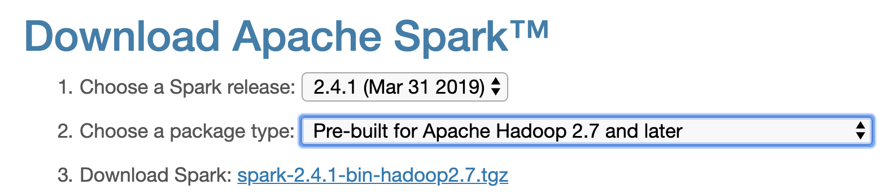
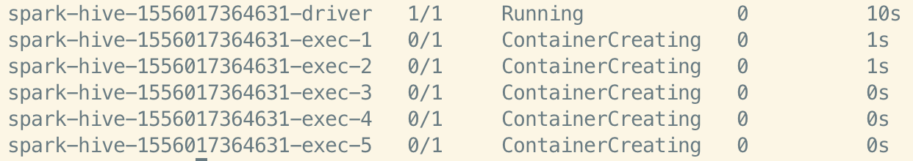
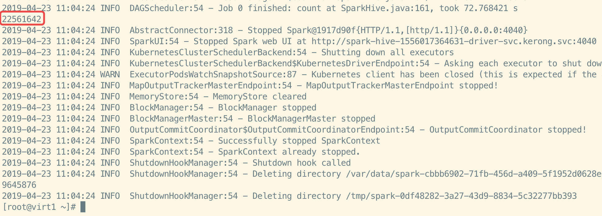
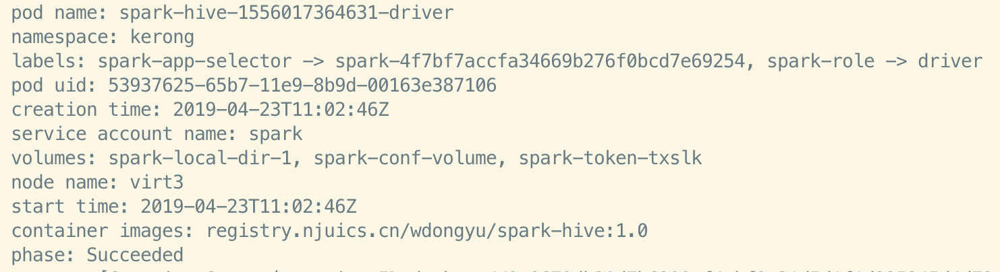

## *Spark-submit Using Kubernetes*

1. 打包**Spark**基础镜像

    到[Spark官网](https://spark.apache.org/downloads.html)中去下载编译好的压缩包，版本应选择在2.3.0之上。
    
    
    
    将压缩包解压：
    
	> tar -zxvf spark-2.4.1-bin-hadoop2.7.tgz
	
	进入主目录打包**Spark**基础镜像，然后上传到镜像仓库中：
	
	> docker build -t registry.njuics.cn/wdongyu/spark:2.4.0 -f kubernetes/dockerfiles/spark/Dockerfile .
	
	> docker push registry.njuics.cn/wdongyu/spark:2.4.0
	
	```
	注意：将上述命令中的仓库地址修改为自己的仓库地址;
		 docker build命令最后的.表示当前目录;
	```
	
	
2.	编写程序代码并打包程序镜像

	使用IDE完成程序代码的编写，使用**mvn package**命令生成jar文件，然后在代码主目录下添加如下内容到Dockerfile文件中：
	
	```
	## 修改为前一步骤中上传的仓库地址
	FROM registry.njuics.cn/wdongyu/spark:2.4.0

	RUN mkdir -p /opt/spark/jars

	COPY target/SparkHive-1.0-SNAPSHOT.jar /opt/spark/jars
	```
	
	在主目录下打包程序镜像并上传镜像：
	
	> docker build -t registry.njuics.cn/wdongyu/spark-hive:1.0 .
	
	> docker push registry.njuics.cn/wdongyu/spark-hive:1.0
	
3.	登录到kubernetes集群中，并使用spark-submit提交任务

	使用ssh命令进行远程登录：
	
	> ssh root@210.28.133.11 -p 21590
	
	进入到spark主目录下:
	
	> cd spark
	
	使用spark-submit命令提交任务：
	
	```
	## 注意对主函数名称、镜像仓库、jar文件名称进行修改
	
	./bin/spark-submit \
	--master k8s://https://172.16.1.137:6443 \
	--deploy-mode cluster \
	--name spark-hive \
	--class com.wdongyu.hive.SparkHive \
	--conf spark.executor.instances=5 \
	--conf spark.kubernetes.container.image.pullPolicy=Always \
	--conf spark.kubernetes.container.image=registry.njuics.cn/wdongyu/spark-hive:1.0 \
	--conf spark.kubernetes.namespace=kerong \
	--conf spark.kubernetes.authenticate.driver.serviceAccountName=spark \
	local:///opt/spark/jars/SparkHive-1.0-SNAPSHOT.jar
	```
	
	任务提交之后，可以打开新的终端窗口执行同样的ssh登录操作，使用kubectl命令查看当前任务状态：
	
	> kubectl get pod -n kerong
	
	
	
	进一步查看作业的输出内容：
	
	> kubectl logs -f spark-hive-1556017364631-driver -n kerong
	
	
	
	spark-submit端输出结果：
	
	