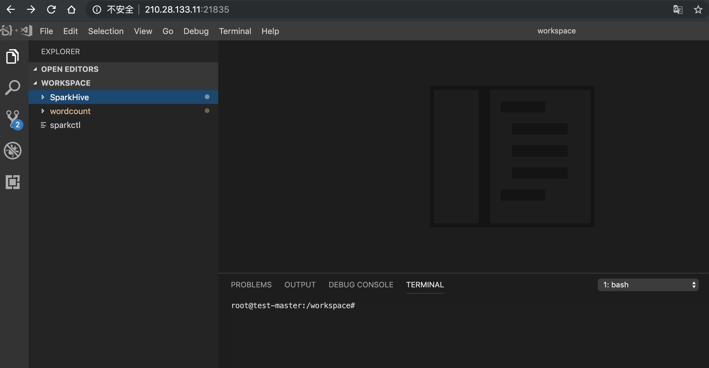
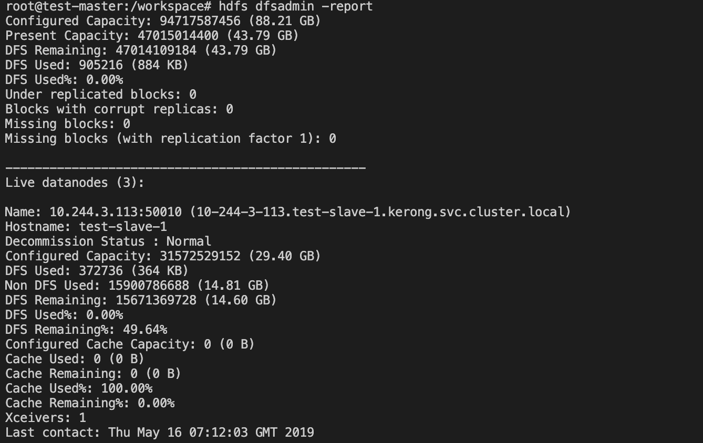
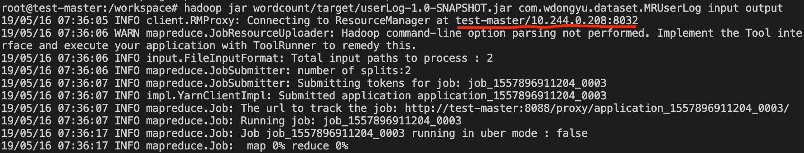
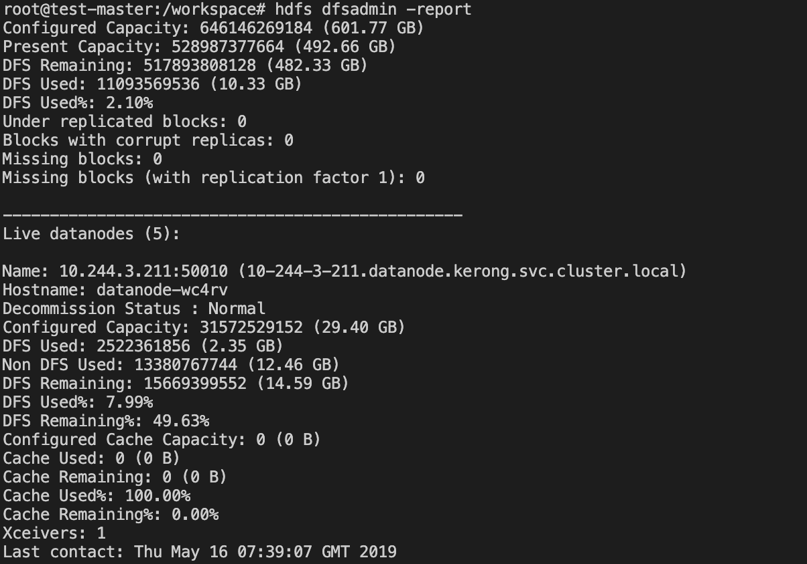
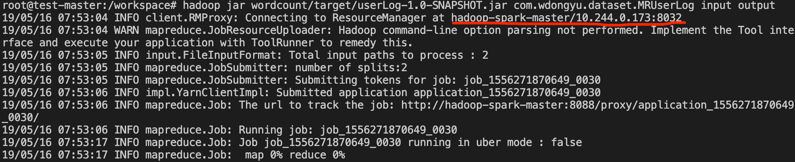
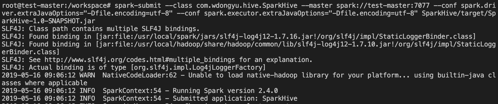
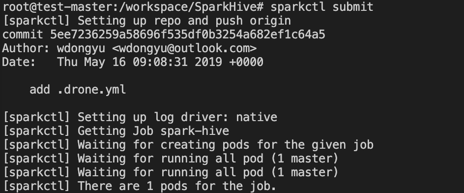
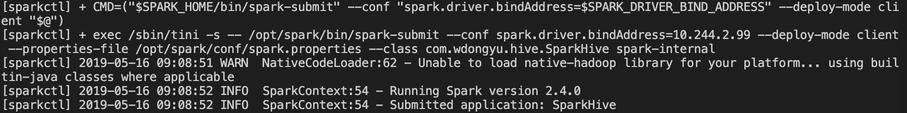

## *Submit MR and Spark jobs on clusters*

* Prerequisites (已完成)
	
	在kubenernetes集群中，手动或自动(使用Operator)地完成Hadoop/Spark集群的创建。已创建完成本地及远端两个规模的Hadoop/Spark集群(均包含了Hadoop、Spark、Hive、Sqoop工作环境)，其中本地集群用于存放小规模数据集及代码调试，远端集群用于存放完整数据集并执行完整的任务。
	
	利用对外提供的[vscode编辑器](http://210.28.133.11:21835/)，我们可在其中编写对应的业务代码，然后在terminal中使用**mvn package**命令生成jar文件，最后完成任务的提交。
	
	
	
1.	提交MR任务

	1.1	本地集群提交
	
	默认情况下，\$HADOOP\_CONF\_DIR指向\$HADOOP_HOME/etc/hadoop
	
	使用hdfs命令，来查看当前集群的节点状态：
		
	> hdfs dfsadmin -report
	
	
	
	将数据导入到集群中，然后使用hadoop命令提交任务：
	
	> hadoop jar path\_to\_jar/xxx.jar MainClass arg1 arg2
	
	
	
	1.2 远端集群提交
		
	将\$HADOOP\_CONF\_DIR指向远端集群的配置：
	
	> export HADOOP\_CONF_DIR=$HADOOP\_HOME/etc/remote\_hadoop
	
	使用hdfs命令，来查看远端集群的节点状态：
		
	> hdfs dfsadmin -report
	
	
	
	集群中已有完整的数据集，直接使用相同的hadoop命令提交任务即可：
	
	> hadoop jar path\_to\_jar/xxx.jar MainClass arg1 arg2
	
	
	
2. 提交Spark任务

	1.1	本地小规模集群提交
	
	使用spark-submit命令提交任务：
	
	```
	## 注意对jar文件名称进行修改
	
	spark-submit \
	--master spark://test-master:7077 \
	--conf spark.driver.extraJavaOptions="-Dfile.encoding=utf-8" \
	--conf spark.executor.extraJavaOptions="-Dfile.encoding=utf-8" \
	SparkHive/target/SparkHive-1.0-SNAPSHOT.jar
	```
	
	
	
	1.2 远端大规模集群提交
	
	进入代码根目录下，使用sparkctl submit命令提交任务：
	
	> sparkctl submit
	
	
	
	